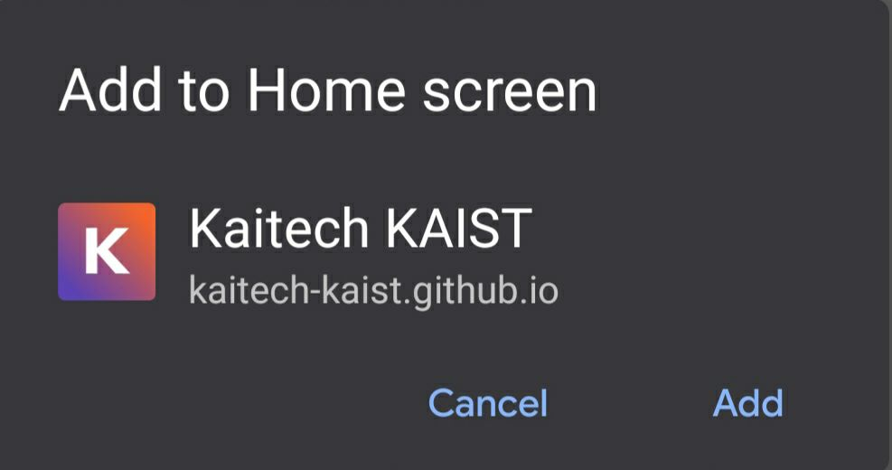

# Kaitech: Guide

Community-based guide/wiki for students interested in tech career!

## Offline usage

As the website is PWA optimized it is possible to install it as a web app if you have Chrome browser.

### On Mobile:

Click on menu tray > Add to Home Screen.



### On Desktop

In url bar to the right click on (+) icon.


## Development

This website is build on top of [GatsbyJS](https://www.gatsbyjs.org/) and [Rocketseat starter theme](https://www.gatsbyjs.org/starters/Rocketseat/gatsby-starter-rocket-docs/). Be sure to install Gatsby in order to develop and preview the website locally.


As a quickstart you can just copy the following commands. 

```sh
git clone https://github.com/kaitech-kaist/guide.git
cd guide
yarn install # or npm
yarn start 
```

## Adding/Editing article

All articles in the current version of the website reside in [`src/docs`](https://github.com/kaitech-kaist/guide/tree/master/src/docs) folder. In order to add an article you have to go through 2 steps:

1. Create file in `src/docs/<Category>/new-article.mdx`, where `<Category>` is a category under which your article is going to be. [(Example of the file)](https://github.com/kaitech-kaist/guide/blob/master/src/docs/university/application-process.mdx)
2. In your `.mdx` file be sure to include title and authorship in this format:
```
---
title: 'Your title'
---
Author(s): [Name](https://github.com/username)

Last updated of: **25 July 2020**
```
> **NOTE: If you are co-authoring/editing, you also have to include your name in Authors line**

3. Edit [`src/config/sidebar.yml`](https://github.com/kaitech-kaist/guide/blob/master/src/config/sidebar.yml) so that it includes the link to your article and a new category if you want to create one.

## Notes
To access original Rocketseat docs on top of which this site was build you can access [this repo](https://github.com/Rocketseat/gatsby-themes/tree/master/%40rocketseat/gatsby-theme-docs).